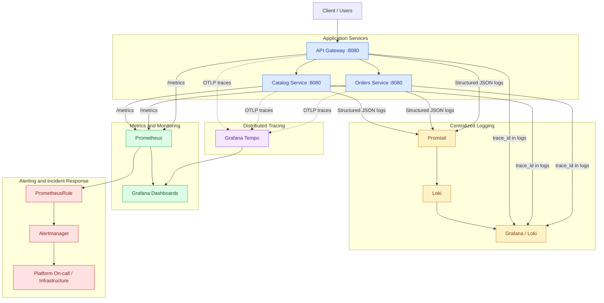

```mermaid
flowchart TB
    Client["Client / Users"]

    subgraph APP["Application Services"]
        Gateway["API Gateway :8080"]
        Catalog["Catalog Service :8080"]
        Orders["Orders Service :8080"]
    end

    subgraph METRICS["Metrics and Monitoring"]
        Prometheus["Prometheus"]
        Grafana["Grafana Dashboards"]
    end

    subgraph LOGGING["Centralized Logging"]
        Promtail["Promtail"]
        Loki["Loki"]
        GrafanaLogs["Grafana / Loki"]
    end

    subgraph TRACING["Distributed Tracing"]
        Tempo["Grafana Tempo"]
    end

    subgraph ALERTING["Alerting and Incident Response"]
        Rules["PrometheusRule"]
        Alertmanager["Alertmanager"]
        OnCall["Platform On-call / Infrastructure"]
    end

    %% Application flows
    Client --> Gateway
    Gateway --> Catalog
    Gateway --> Orders

    %% Metrics flows
    Catalog -->|"/metrics"| Prometheus
    Orders -->|"/metrics"| Prometheus
    Gateway -->|"/metrics"| Prometheus
    Prometheus --> Grafana

    %% Logging flows
    Catalog -->|"Structured JSON logs"| Promtail
    Orders -->|"Structured JSON logs"| Promtail
    Gateway -->|"Structured JSON logs"| Promtail
    Promtail --> Loki
    Loki --> GrafanaLogs

    %% Tracing flows
    Gateway -->|"trace_id in logs"| GrafanaLogs
    Catalog -->|"trace_id in logs"| GrafanaLogs
    Orders -->|"trace_id in logs"| GrafanaLogs
    Gateway -.->|"OTLP traces"| Tempo
    Catalog -.->|"OTLP traces"| Tempo
    Orders -.->|"OTLP traces"| Tempo
    Tempo --> Grafana

    %% Alerting flows
    Prometheus --> Rules
    Rules --> Alertmanager
    Alertmanager --> OnCall

    %% Styling
    classDef app fill:#dbeafe,stroke:#2563eb,color:#1e3a8a
    classDef metrics fill:#dcfce7,stroke:#16a34a,color:#14532d
    classDef logs fill:#fef3c7,stroke:#d97706,color:#78350f
    classDef traces fill:#f3e8ff,stroke:#9333ea,color:#581c87
    classDef alerts fill:#fee2e2,stroke:#dc2626,color:#7f1d1d

    class Gateway,Catalog,Orders app
    class Prometheus,Grafana metrics
    class Promtail,Loki,GrafanaLogs logs
    class Tempo traces
    class Rules,Alertmanager,OnCall alerts
```
